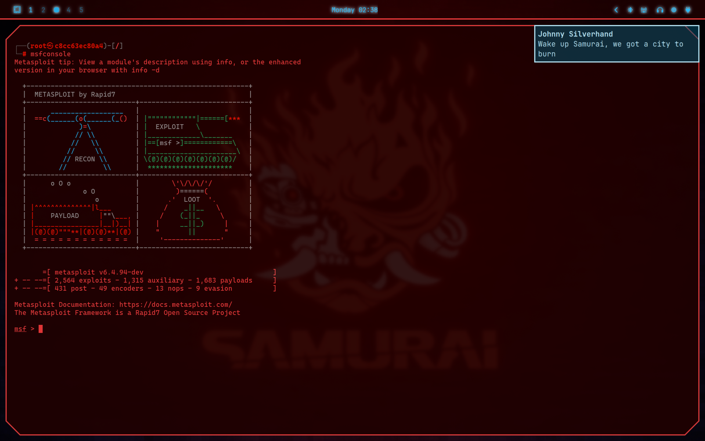

```
   ▄████▄▓██   ██▓ ▄▄▄▄   ▓█████  ██▀███   ██▓███   █    ██  ███▄    █  ██ ▄█▀
  ▒██▀ ▀█ ▒██  ██▒▓█████▄ ▓█   ▀ ▓██ ▒ ██▒▓██░  ██▒ ██  ▓██▒ ██ ▀█   █  ██▄█▒ 
  ▒▓█    ▄ ▒██ ██░▒██▒ ▄██▒███   ▓██ ░▄█ ▒▓██░ ██▓▒▓██  ▒██░▓██  ▀█ ██▒▓███▄░ 
  ▒▓▓▄ ▄██▒░ ▐██▓░▒██░█▀  ▒▓█  ▄ ▒██▀▀█▄  ▒██▄█▓▒ ▒▓▓█  ░██░▓██▒  ▐▌██▒▓██ █▄ 
  ▒ ▓███▀ ░░ ██▒▓░░▓█  ▀█▓░▒████▒░██▓ ▒██▒▒██▒ ░  ░▒▒█████▓ ▒██░   ▓██░▒██▒ █▄
  ░ ░▒ ▒  ░ ██▒▒▒ ░▒▓███▀▒░░ ▒░ ░░ ▒▓ ░▒▓░▒▓▒░ ░  ░░▒▓▒ ▒ ▒ ░ ▒░   ▒ ▒ ▒ ▒▒ ▓▒
    ░  ▒  ▓██ ░▒░ ▒░▒   ░  ░ ░  ░  ░▒ ░ ▒░░▒ ░     ░░▒░ ░ ░ ░ ░░   ░ ▒░░ ░▒ ▒░
  ░       ▒ ▒ ░░   ░    ░    ░     ░░   ░ ░░        ░░░ ░ ░    ░   ░ ░ ░ ░░ ░ 
  ░ ░     ░ ░      ░         ░  ░   ░                 ░              ░ ░  ░   
  ░       ░ ░           ░                                                     
```

## About

My first public Omarchy theme. I wanted something with a proper cyberpunk vibe, so I took Dizziee's excellent Aetheria theme and pushed it in a neon  red direction.

The color scheme is built around red and cyan with a near-black background. The waybar has animated glowing icons and a glitchy active workspace indicator. OLED screens will love this.



> Based on [Aetheria](https://github.com/JJDizz1L/aetheria) by Dizziee

## Installation

Pick one:

**Terminal**
```
omarchy-theme-install https://github.com/SeanAnd/omarchy-cyberpunk-theme.git
```

**Walker Menu**
1. Copy: `https://github.com/SeanAnd/omarchy-cyberpunk-theme.git`
2. Open Walker (`SUPER+ALT+SPACE`), go to Install > Style > Theme
3. Paste and hit enter

## What's Included

- Full color scheme via colors.toml
- Waybar styling with glow and glitch animations
- Themes for Zed, Neovim, btop, Discord (Vencord), and more
- A couple cyberpunk wallpapers

## Discord Theme

If you use Vencord/Equicord/Vesktop, copy `vencord.theme.css` to your themes folder and enable it. Or just use [omarchy-theme-hook](https://github.com/imbypass/omarchy-theme-hook) and it handles everything.

## Credits

- [Aetheria](https://github.com/JJDizz1L/aetheria) by Dizziee for the foundation
- [Waveform Dark](https://github.com/hipsterusername/omarchy-waveform-dark-theme) for additional inspiration
